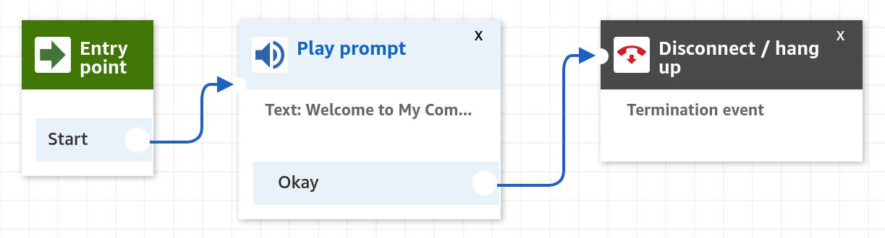

# Connect Contact Flow Builder

A JavaScript DSL and CLI tool for generating Amazon Connect Contact Flow configurations.

# Installation

```shell script
# Install with npm
npm i --save-dev connect-contact-flow-builder

# ...or with yarn
yarn add -D connect-contact-flow-builder
```

# Usage

First, define a Contact Flow:

**simpleGreeting.js**
```javascript
const { PlayPrompt, Disconnect } = require('connect-contact-flow-builder');

module.exports = (companyName) => {
  const mainNode = new PlayPrompt({ 
    text: `Welcome to ${companyName}!`,
  });
  const disconnect = new Disconnect();
  mainNode.setSuccessBranch(disconnect);

  return mainNode
};
```

Then, run `build-contact-flow` to generate a configuration JSON:

```shell script
build-contact-flow simpleGreeting.js "My Company" > simpleGreeting.json
```

Finally, import the generated JSON into Connect:



# API

See [API.md](API.md).

# Support Table

## Interact

| Class | Implemented? | Original name | Description |
|---|---|---|---|
| `PlayPrompt` | No | Play prompt | Delivers an audio or chat message. |
| `GetCustomerInput` | No | Get customer input | Branches based on customer intent. |
| `StoreCustomerInput` | No | Store customer input | Stores numerical input to contact attribute. |
| `HoldCustomerOrAgent` | No | Hold customer or agent | Places a customer or agent on or off hold. |
| `StartMediaStreaming` | No | Start media streaming | Starts streaming media to Kinesis. |
| `StopMediaStreaming` | No | Stop media streaming | Stops streaming media to Kinesis. |

## Set

| Class | Implemented? | Original name | Description |
|---|---|---|---|
| `SetWorkingQueue` | No | Set working queue | Specify the queue that the contact will be transferred to. |
| `SetContactAttributes` | No | Set contact attributes | Define and store key-value pairs as contact attributes. |
| `ChangeRoutingPriorityAge` | No | Change routing priority / age | Alters the priority of the contact in queue. |
| `SetLoggingBehavior` | No | Set logging behavior | Enables or disables Contact Flow Logs. |
| `SetRecordingAndAnalyticsBehavior` | No | Set recording and analytics behavior | Specify call recording behavior and set up speech analytics. You must set up recording to use speech analytics.  |
| `SetHoldFlow` | No | Set hold flow | Specify the flow to invoke when a customer or agent is put on hold during phone call. |
| `SetCustomerQueueFlow` | No | Set customer queue flow | Specifies the flow to run when a customer is transferred to a queue. |
| `SetWhisperFlow` | No | Set whisper flow | Specifies the whisper played to a customer or agent for inbound and outbound calls. |
| `SetDisconnectFlow` | No | Set disconnect flow | Specifies which contact flow to run when a customer remains on the call after the agent disconnects. |
| `SetCallbackNumber` | No | Set callback number | Specify an attribute to set the customer callback number. |
| `SetVoice` | No | Set voice | Specify the language and voice that the customer hears during text-to-speech interactions. |
| `GetQueueMetrics` | No | Get queue metrics | Loads queue metrics for flow to use |

## Branch

| Class | Implemented? | Original name | Description |
|---|---|---|---|
| `CheckQueueStatus` | No | Check queue status | Check the amount of time the oldest contact has been in queue, or the queue capacity, and branch accordingly.  If no match is found, the contact is routed down the No Match branch. |
| `CheckStaffing` | No | Check staffing | Branches based on whether agents are available, staffed (for example, available, on call, or after call work), or online. |
| `CheckHoursOfOperation` | No | Check hours of operation | Checks the hours of operation, then branches based on whether it is in hours or out of hours. |
| `CheckContactAttributes` | No | Check contact attributes | Branches based on a comparison to the value of a contact attribute. |
| `DistributeByPercentage` | No | Distribute by percentage | Routes customers randomly based on specified percentage. |
| `Loop` | No | Loop | Repeats the looping branch for the specified number of times. After which, the complete branch is followed. |
| `Wait` | No | Wait | Waits for a specified period of time, and optionally for specified events. This block is supported for chat only. |

## Integrate

| Class | Implemented? | Original name | Description |
|---|---|---|---|
| `InvokeAWSLambdaFunction` | No | Invoke AWS Lambda function | Makes a call to AWS Lambda and optionally returns key/value pairs, which can be used to set contact attributes. |

## Terminate / Transfer

| Class | Implemented? | Original name | Description |
|---|---|---|---|
| `DisconnectHangUp` | No | Disconnect / hang up | Disconnects the interaction. |
| `TransferToQueue` | No | Transfer to queue | Ends the current contact flow and places the customer in queue. |
| `TransferToPhoneNumber` | No | Transfer to phone number | Transfers the customer to a phone number. |
| `TransferToFlow` | No | Transfer to flow | Ends the current flow and transfers the customer to a flow of type contact flow. |

# License

This software is [MIT licensed](LICENSE).
